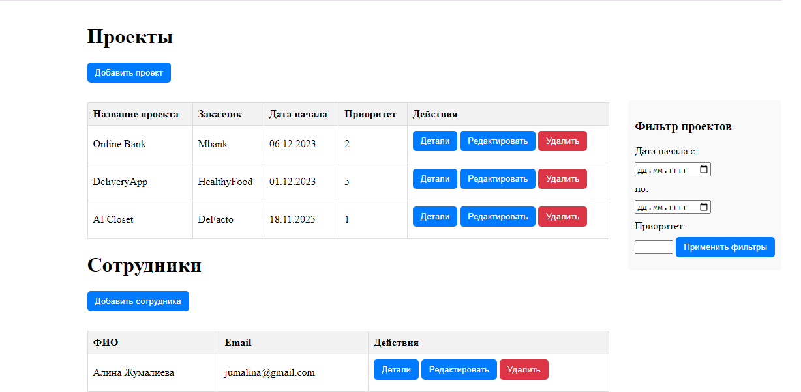
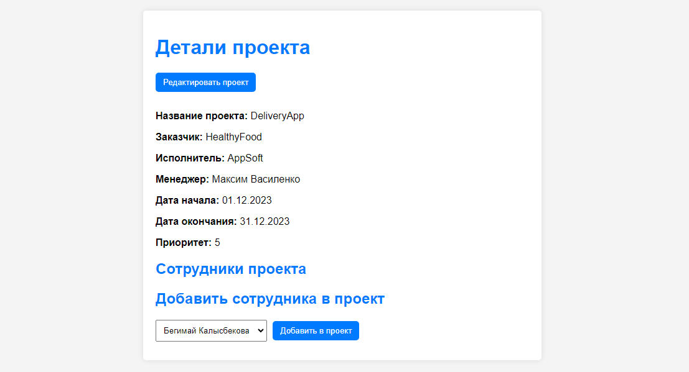
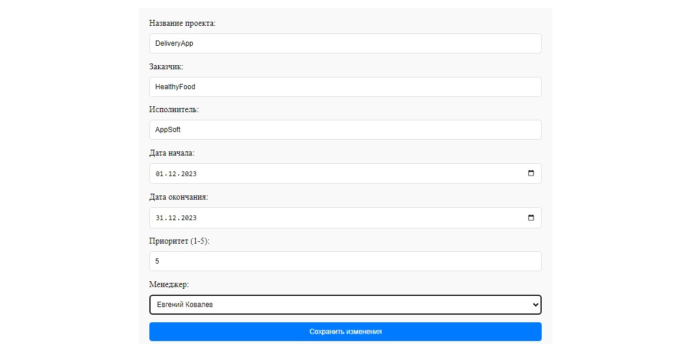

# Project Management (Тестовое задание)
<h2>Описание</h2>
Проект выполнен на C# ASP.NET Core (EntityFramework Code First, Web API, .NET Core 6). 
В качестве хранилища данных использован MSSQL. 
 
Функциональные возможности:
<ul>
  <li>возможность создавать/просматривать/редактировать/удалять информацию о проектах;
  <li>возможность создавать/просматривать/редактировать/удалять информацию о сотрудниках;
  <li>возможность добавлять и удалять сотрудников c проекта (один сотрудник может работать 
  одновременно на нескольких проектах, и на одном проекте может работать несколько человек);
  <li>для просмотра проектов предусмотрены различные способы фильтрации (по диапазону даты 
  начала, по приоритетам) и сортировки (по основным полям).
</ul>

Использованные библиотеки и пакеты: 
Microsoft.EntityFrameworkCore 6.0.22 
Microsoft.EntityFrameworkCore.SqlServer 6.0.22 
Microsoft.EntityFrameworkCore.Tools 6.0.22 
Microsoft.EntityFrameworkCore.Design 6.0.22 
AutoMapper 12.0.1 
AutoMapper.Extensions.Microsoft.DependencyInjection 12.0.1 
Swashbuckle.AspNetCore 6.5.0 

<h2>Установка и запуск</h2>
<ol>
  <li>Склонируйте репозиторий к себе на локальный компьютер
  <li>В файле appsettings.json в проекте WebApi поменяйте имя сервера на имя вашего сервера
  <li>В консоле диспетчера пакетов ("Проект по умолчанию" выберите: DAL) введите update-database 
  <li>Запустите проект  
</ol>
При запуске база данных будет заполнена начальными данными
  

